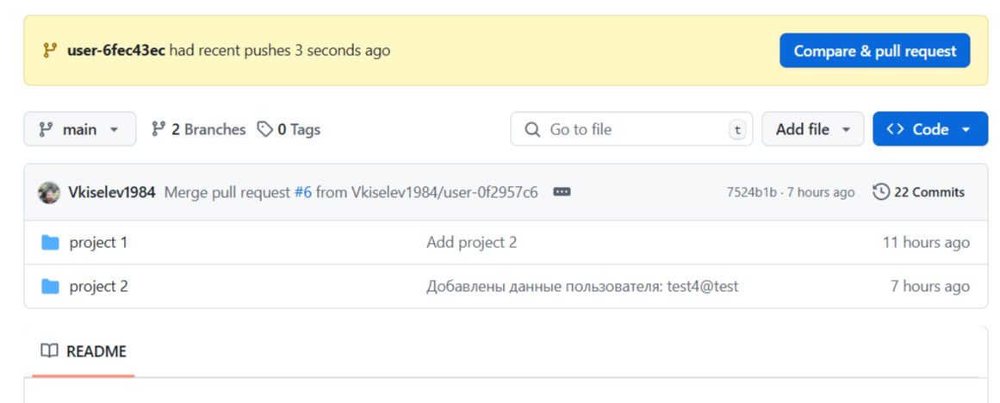
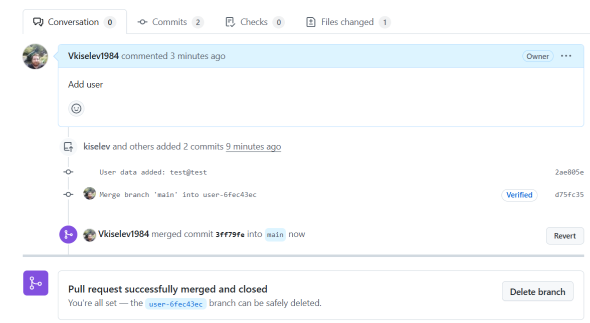
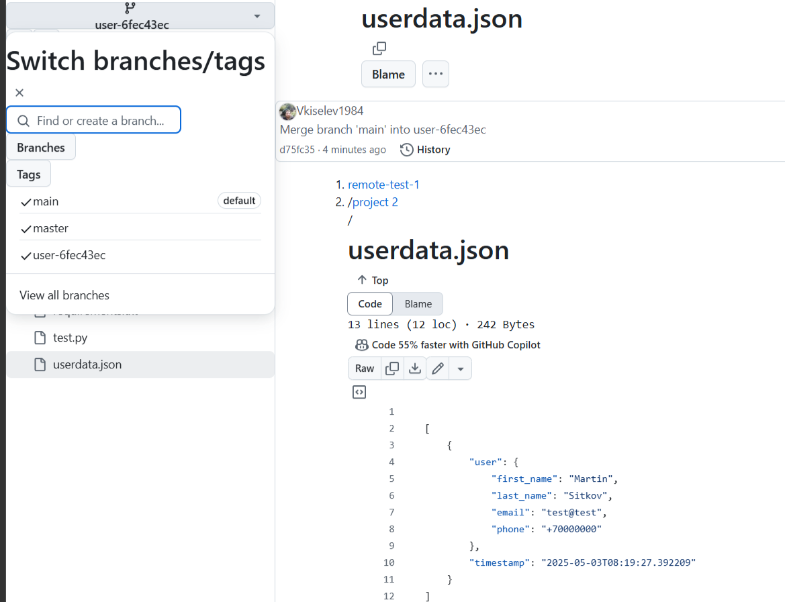

# Working with changes

## Task #2

1. Look through the commit history of your project and pick three random commits. Look at the changes that were made in them.

2. Revert these changes with the git revert command one after another, so that you end up with three commits.

3. Try to undo these three commits:

- the last one — with the git reset --soft and git restore commands;

- the second to last one — with the git reset --mixed and git restore command;

- the first one — with the git reset --hard command.

## Solution

For the second task, we created a small Python project that contains a frontend — an html page.

The forms on this page allow the user to save their first name, last name, email, and phone number.

The project also contains backend files according to mvc and oop, and a configuration file that configures the work between the html page and the backend.

The gitignore file contains a list of files that should not be sent to Git.

Instead of a database, a JSON file on a remote server is used. The data entered by the user is committed and sent to the remote Git repository as pull requests. A separate branch is created for each commit, which should not merge with the main one when unloading data.

As a training exercise, it is suggested to perform actions with the received data, branches and commit history manually.

### Run the project in VSCode:

1. Open the project folder in VSCode.

Create and activate the virtual environment:

```Terminal
venv\Scripts\activate
```

2. Install dependencies:

```bash
pip install -r requirements.txt
```

3. Run the project:

```bash
python main.py
```

4. Go to the address in your browser:
   http://127.0.0.1:5000/

### Important

- To work correctly with Git, make sure that your project is initialized as a git repository and a remote repository is configured (git init, git remote add origin <url>).
- The server must have SSH or HTTPS access configured with pre-configured authorization.

### SSH auth

For automatic execution of Git commands to work correctly, make sure that:

SSH access to the remote repository is configured.

The SSH key is added to your GitHub/GitLab/Bitbucket account and is available for use.

On the first run, manually confirm the connection to the remote server to avoid an interactive prompt during automatic execution.

1. Example of checking the connection (run manually in the terminal):

```Terminal
ssh -T git@github.com
```

2. The command dir %USERPROFILE%\.ssh will list the existing keys. If there are none, create a new SSH key:

```Terminal
ssh-keygen -t ed25519 -C "your_email@example.com"
```

3. Add SSH key to SSH agent.

Start the SSH agent:

```Terminal
eval `ssh-agent -s`
```

Add the key to the agent:

```Terminal
ssh-add ~/.ssh/id_ed25519
```

4. Add your public SSH key to GitHub

5. Check your connection to GitHub via SSH

## Practice

So we have launched the project and now we will enter the user data in the browser. After confirmation, a window about successful execution will appear, and on the remote server a pull request with a new branch.



After confirmation of the upload, you need to merge pull request.



We got a new branch with user data.


